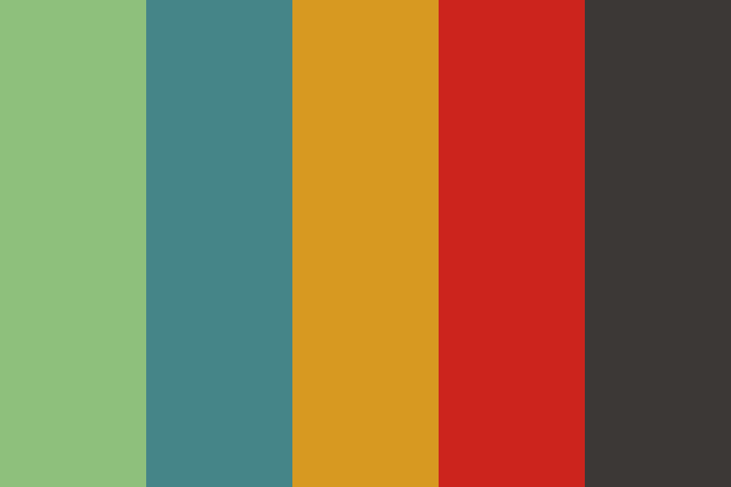

# Gruvbox-Dark Color Palette

A quick refrence for a simplified Gruvbox-Dark color palette.

This project is a simple html project to practice creating static web pages with css styling.
I am not a developer, I just tinker around so I downloaded the site and started pulling things apart until it broke and then fixxing what broke while adding and removing things to see what would happen.

## Modifications made:

- Responsive vertical layout.
- Click to copy hex color code.
- Download link to PNG.
- Eye friendly background color.

## Attribution

Based on the Gruvbox-Dark palette created
 by [GlennTatum](https://www.color-hex.com/member/glenntatum) on [color-hex.com](https://www.color-hex.com/color-palette/1026676).

I believe this is GlennTatum's [github page](https://github.com/GlennTatum).

